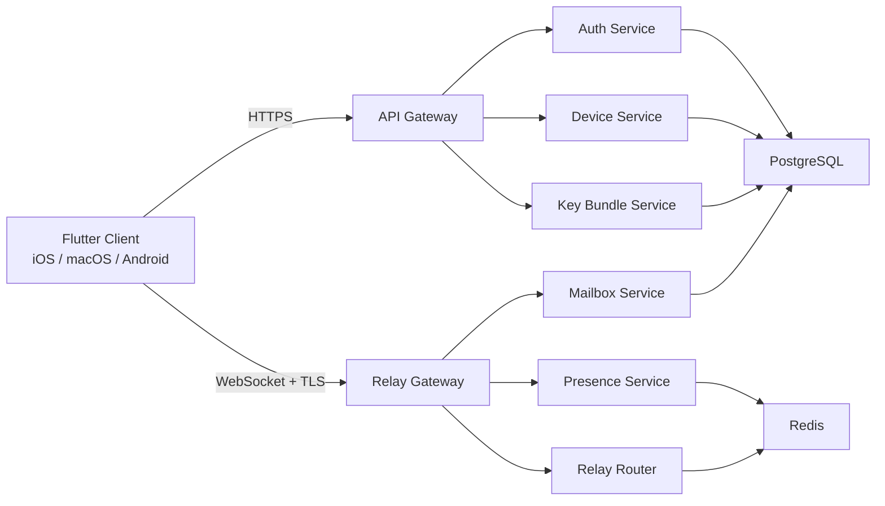
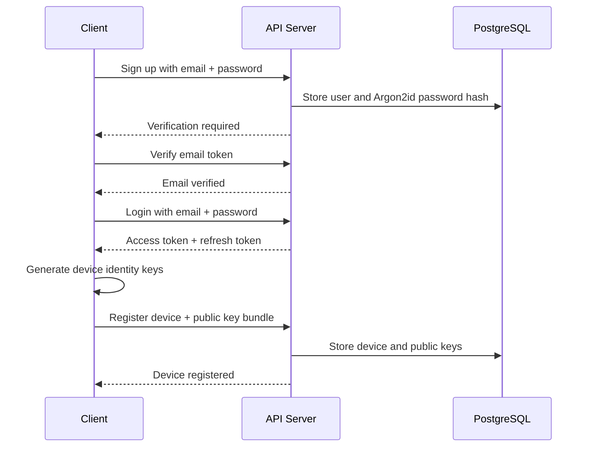
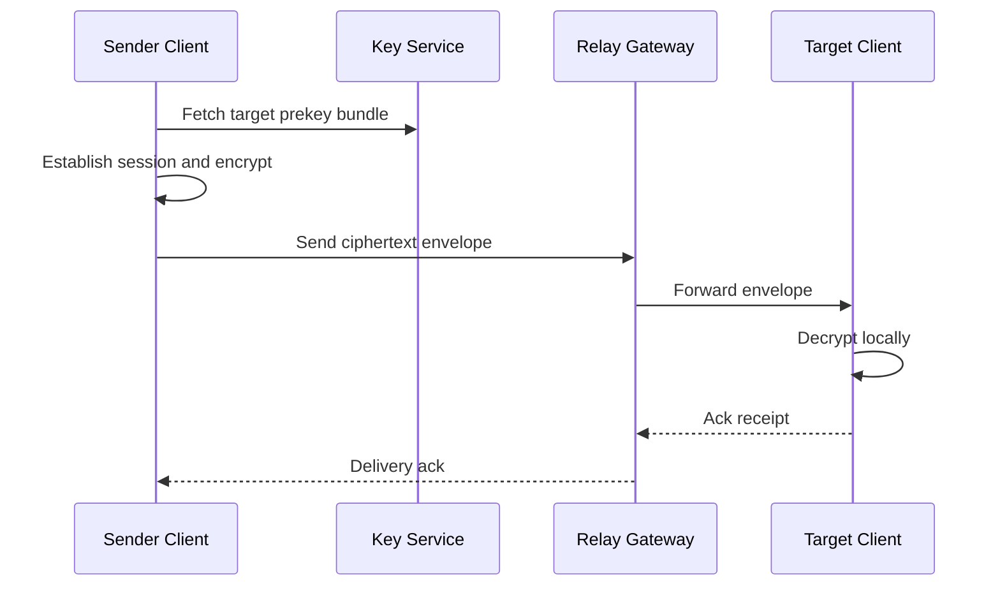
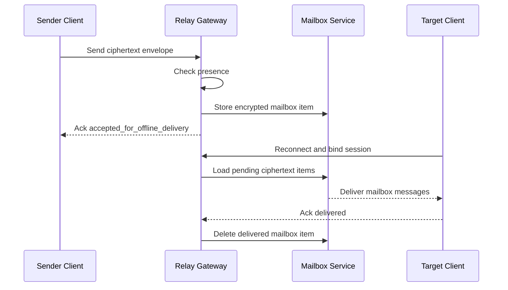
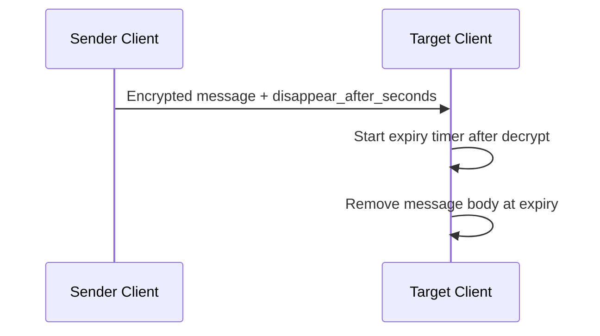

# circle-link Technical Design

## 1. Overview

`circle-link` is a privacy-first chat system with two modules:

1. `server`: handles user authentication, device registration, key directory, real-time relay, offline encrypted mailbox delivery, and presence.
2. `client`: a shared cross-platform application that builds iOS, macOS, and Android clients from one main codebase.

The system still follows a "no server-side readable history" model, but because offline delivery is now required, the server is allowed to store undelivered ciphertext envelopes temporarily. This means:

- the server does not store plaintext messages
- the server does not keep permanent chat history
- the server may store encrypted pending messages until delivery or expiration
- delivered or expired mailbox items must be deleted immediately

## 2. Confirmed Product Decisions

The following product decisions are now treated as fixed requirements:

1. Offline message delivery is required.
2. Login is fixed as `email + password`.
3. Clients keep encrypted local history by default, and also support per-message disappearing mode.

## 3. Product Goals

### 3.1 Goals

- Private one-to-one chat with strong end-to-end encryption.
- Shared client stack for iOS, macOS, and Android.
- Real-time messaging for online users and encrypted deferred delivery for offline users.
- Multi-device login for one account.
- Server sees only metadata and ciphertext, never plaintext.
- Local message history is encrypted at rest and retained by default.
- Users can send disappearing messages with per-message expiration.

### 3.2 Non-goals for v1

- Large group chat
- Web client
- Search across server-hosted chat history
- Rich public discovery or social features
- Unencrypted media preview processing on the server

## 4. Privacy Model And Constraints

### 4.1 What The Server May Store

- user records
- password hashes
- device records
- public key bundles
- session tokens
- presence metadata
- contact or allowlist metadata
- encrypted undelivered mailbox items
- operational audit metadata that excludes message content

### 4.2 What The Server Must Not Store

- message plaintext
- permanent message history
- decrypted attachment contents
- logs containing message bodies
- logs containing passwords or private keys

### 4.3 Offline Delivery Exception

Offline delivery changes the original "relay-only" model. The updated rule is:

- online messages are relayed immediately whenever possible
- if the target device is offline, the server stores only the encrypted message envelope
- stored ciphertext has a bounded retention window
- after successful delivery, expiration, or sender recall before delivery if supported later, the ciphertext is deleted

Recommended v1 mailbox retention:

- default TTL: 7 days
- delete on successful acknowledgement
- hard-delete expired ciphertext in a background cleanup job

This preserves privacy much better than normal server-side history, while still meeting offline delivery requirements.

## 5. Recommended Technology Choices

### 5.1 Client

- Framework: Flutter
- Language: Dart
- State management: Riverpod
- Navigation: `go_router`
- Local database: SQLite with Drift
- Local database encryption: SQLCipher or equivalent page-level encryption
- Secure storage: Keychain on iOS/macOS, Android Keystore on Android
- Shared crypto core: Rust via `flutter_rust_bridge`
- Push:
  - iOS/macOS: APNs
  - Android: FCM

Why Flutter:

- one shared UI and application layer across iOS, macOS, and Android
- mature ecosystem for mobile and desktop
- good fit for private-chat UX with native bridge support

### 5.2 Server

- Language: Go
- HTTP router: `chi`
- Real-time transport: WebSocket over TLS
- Primary database: PostgreSQL
- Cache / fan-out / presence bus: Redis
- Wire contracts: Protocol Buffers
- Deployment: Docker first, Kubernetes optional later

Why Go:

- good fit for WebSocket concurrency and relay traffic
- simple operational footprint
- strong typing and easy service decomposition

## 6. High-Level Architecture



## 7. Authentication And Account Model

### 7.1 Login Method

Authentication is fixed as `email + password`.

Recommended v1 account lifecycle:

- user signs up with email and password
- server verifies email ownership
- client logs in with email and password
- server returns access token and refresh token
- client registers one or more devices after login

### 7.2 Password Handling

The server must never store raw passwords.

Required controls:

- hash passwords using Argon2id
- generate unique random salt per password
- optional server-side pepper in secret management
- rate-limit login attempts by IP, email, and device
- support password change and session revocation

Recommended Argon2id baseline:

- memory: 64 MB or higher
- iterations: tune by environment, starting around 2 to 4
- parallelism: 1 to 4 depending on deployment

Exact parameters should be benchmarked before production.

Implementation note:

- the current local bootstrap uses a temporary stdlib-only iterative SHA-256 password hasher so the project can run without external crypto dependencies
- this must be replaced with Argon2id before production use

### 7.3 Session Model

- short-lived access token, recommended 15 minutes
- rotating refresh token, recommended 30 days
- refresh token stored hashed in database
- each session bound to a device record

### 7.4 Email Verification

Recommended:

- verification required before first message send
- sign-up generates verification token
- token expires after 15 to 30 minutes
- resend flow is rate-limited

## 8. End-to-End Encryption Design

### 8.1 Recommended Protocol

Use a Signal-style protocol:

- identity key pair per device: X25519
- signed prekey per device
- one-time prekeys per device
- initial session setup: X3DH
- message progression: Double Ratchet
- payload encryption: ChaCha20-Poly1305 or AES-256-GCM

### 8.2 Key Ownership

- private keys are generated and stored on the client
- private keys never leave the device
- server stores only public bundles and metadata
- signed prekeys rotate periodically
- one-time prekeys are replenished in batches

### 8.3 Trust Model

- server is trusted for identity, password verification, session issuance, and device directory accuracy
- server is not trusted with message confidentiality
- clients should support device fingerprint verification for high-assurance contacts

## 9. Delivery Model

### 9.1 Online Delivery

- sender encrypts locally
- sender sends ciphertext envelope over WebSocket
- relay forwards to online recipient device
- recipient decrypts locally
- recipient sends delivery acknowledgement
- server removes any transient relay buffer after completion

### 9.2 Offline Delivery

When the recipient is offline:

- sender still encrypts locally
- sender sends ciphertext envelope to relay gateway
- server validates metadata and mailbox policy
- server stores only the encrypted envelope in mailbox storage
- recipient reconnects and binds authenticated WebSocket session
- pending mailbox items are streamed to the recipient
- delivered items are deleted after acknowledgement

### 9.3 Mailbox Storage Policy

Mailbox items must contain only routing metadata plus ciphertext. Recommended policy:

- retention TTL: 7 days
- size limit per message and per mailbox
- per-user mailbox quota
- delete on delivery acknowledgement
- cleanup worker removes expired items
- mailbox encryption at rest enabled at database level

### 9.4 Offline Delivery Tradeoff

Because offline delivery is required, the system can no longer claim "the server never stores any message bytes." The correct statement becomes:

- the server stores only encrypted undelivered message envelopes temporarily
- the server never stores readable plaintext history
- the server never keeps permanent conversation archives

## 10. Disappearing Messages

### 10.1 Product Behavior

The client supports two message retention modes:

1. default persistent local history
2. optional disappearing messages

Disappearing mode is per-message in v1.

### 10.2 Expiration Semantics

Recommended v1 behavior:

- sender sets a `disappear_after_seconds` value
- expiration starts when the recipient device successfully decrypts the message
- clients remove expired message bodies from local history
- local conversation list may retain a tombstone like "message expired" for UX consistency

### 10.3 Server Behavior For Disappearing Messages

- server stores the encrypted envelope only until delivery or mailbox expiry
- server does not need to keep a special long-term disappearing-message store
- if a disappearing message expires before offline delivery, mailbox cleanup deletes it

Recommended rule:

- effective server-side mailbox TTL is `min(mailbox_ttl, disappear_after_seconds)` when disappearing mode is shorter

## 11. Message Envelope Design

The server relays opaque ciphertext envelopes. Suggested envelope fields:

- `message_id`
- `conversation_id`
- `sender_user_id`
- `sender_device_id`
- `recipient_user_id`
- `recipient_device_id`
- `sent_at`
- `ciphertext`
- `header`
- `ratchet_public_key`
- `content_type`
- `client_message_seq`
- `offline_eligible`
- `disappear_after_seconds`
- `expires_at`

The ciphertext is opaque to the server. Metadata must be minimized so the server can route, expire, and acknowledge messages without learning content.

## 12. Server Module Design

### 12.1 API Gateway

Responsibilities:

- expose HTTPS APIs
- authenticate access tokens
- route requests to auth, device, contacts, and key services
- apply rate limiting and request validation

### 12.2 Auth Service

Responsibilities:

- sign up account
- verify email
- login with email and password
- refresh session
- logout and revoke sessions
- change password

### 12.3 Device Service

Responsibilities:

- register device
- list devices
- revoke device
- update push token

### 12.4 Key Bundle Service

Responsibilities:

- upload device public key material
- return target prekey bundles
- manage one-time prekey depletion
- rotate signed prekeys

### 12.5 Relay Gateway

Responsibilities:

- maintain authenticated WebSocket sessions
- receive encrypted envelopes
- route to recipient devices
- emit acknowledgements and negative acknowledgements

### 12.6 Mailbox Service

Responsibilities:

- persist undelivered encrypted envelopes
- stream pending messages on reconnect
- enforce TTL and quota
- delete delivered and expired items

### 12.7 Presence Service

Responsibilities:

- track device connectivity
- publish presence changes across nodes
- support mailbox vs direct-relay routing decisions

## 13. Data Model

### 13.1 PostgreSQL Tables

- `users`
  - `id`
  - `email`
  - `password_hash`
  - `email_verified_at`
  - `display_name`
  - `status`
  - `created_at`
  - `updated_at`

- `devices`
  - `id`
  - `user_id`
  - `device_name`
  - `platform`
  - `push_token`
  - `last_seen_at`
  - `revoked_at`
  - `created_at`

- `device_keys`
  - `device_id`
  - `identity_key_public`
  - `signed_prekey_public`
  - `signed_prekey_signature`
  - `signed_prekey_version`
  - `one_time_prekey_count`
  - `updated_at`

- `email_verifications`
  - `id`
  - `user_id`
  - `token_hash`
  - `expires_at`
  - `used_at`

- `auth_sessions`
  - `id`
  - `user_id`
  - `device_id`
  - `refresh_token_hash`
  - `expires_at`
  - `revoked_at`
  - `created_at`

- `contacts`
  - `owner_user_id`
  - `peer_user_id`
  - `state`
  - `created_at`

- `mailbox_messages`
  - `id`
  - `message_id`
  - `conversation_id`
  - `sender_user_id`
  - `sender_device_id`
  - `recipient_user_id`
  - `recipient_device_id`
  - `content_type`
  - `envelope_bytes`
  - `offline_eligible`
  - `disappear_after_seconds`
  - `expires_at`
  - `created_at`
  - `delivered_at`

Important:

- `mailbox_messages.envelope_bytes` stores ciphertext envelope only
- there is still no plaintext message table
- there is still no permanent conversation archive table

### 13.2 Index Suggestions

- unique index on `users.email`
- index on `devices.user_id`
- index on `auth_sessions.user_id`
- composite index on `mailbox_messages(recipient_device_id, expires_at)`
- index on `mailbox_messages(message_id)`

## 14. API And Real-Time Protocol

### 14.1 Transport Split

- REST over HTTPS:
  - sign up
  - email verification
  - login
  - session refresh
  - device registration
  - prekey upload and fetch
  - contacts

- WebSocket over TLS:
  - session bind
  - presence updates
  - message send
  - message delivery
  - mailbox drain on reconnect
  - acknowledgements

### 14.2 Suggested REST Endpoints

- `POST /v1/auth/signup`
- `POST /v1/auth/verify-email`
- `POST /v1/auth/login`
- `POST /v1/auth/refresh`
- `POST /v1/auth/logout`
- `POST /v1/auth/change-password`
- `POST /v1/devices`
- `GET /v1/devices`
- `DELETE /v1/devices/{deviceId}`
- `GET /v1/users/{userId}/prekey-bundle`
- `POST /v1/devices/{deviceId}/prekeys`
- `GET /v1/contacts`
- `POST /v1/contacts/invite`

### 14.3 Suggested WebSocket Events

- `session.bind`
- `presence.snapshot`
- `presence.update`
- `message.send`
- `message.deliver`
- `message.mailbox`
- `message.ack`
- `message.nack`
- `mailbox.drained`
- `device.revoked`
- `system.error`

## 15. Client Module Design

### 15.1 Recommended Flutter Layout

```text
client/
|-- apps/
|-- lib/
|   |-- app/
|   |-- core/
|   |-- features/
|   |-- services/
|   `-- shared/
|-- native/
|-- rust/
`-- test/
```

### 15.2 Feature Boundaries

- `features/auth`
  - sign up
  - login
  - email verification
  - session refresh
  - password change

- `features/chat`
  - conversation list
  - composer
  - live delivery state
  - mailbox recovery after reconnect
  - disappearing message timers

- `features/contacts`
  - contacts
  - allowlist or invite flow

- `features/devices`
  - device list
  - revoke device
  - key and security status

### 15.3 Local Storage Rules

- local history is retained by default
- all local history is encrypted at rest
- message expiration is enforced by client-side cleanup for disappearing messages
- encryption keys are stored in secure OS facilities

Suggested local stores:

- secure storage:
  - identity private key
  - session secrets
  - DB encryption key
  - access token
  - refresh token

- encrypted SQLite:
  - conversations
  - local message history
  - mailbox sync checkpoints
  - disappearing-message metadata
  - contact cache

### 15.4 Local Message Lifecycle

For normal messages:

- store locally after successful send or receipt
- retain until user deletes conversation or account data

For disappearing messages:

- store locally after successful send or receipt
- mark with expiration policy
- delete body on expiry
- optionally keep minimal tombstone entry for UI continuity

## 16. Rust Crypto Core

Rust module responsibilities:

- key generation
- prekey bundle creation
- X3DH session setup
- Double Ratchet encrypt and decrypt
- message envelope packing helpers
- disappearing-message metadata validation

Why Rust:

- safer crypto implementation boundary than Dart
- shared logic across all platforms
- easier protocol test-vector coverage

## 17. Message Flows

### 17.1 Sign Up And Device Registration



### 17.2 Online Message Delivery



### 17.3 Offline Message Delivery



### 17.4 Disappearing Message Delivery



## 18. Notifications

Push notifications must not contain plaintext message content.

Recommended behavior:

- send only generic wake-up or pending-message indicators
- app reconnects and drains mailbox or live relay
- previews are disabled by default

## 19. Security Controls

- TLS 1.3 only
- certificate pinning in production mobile builds
- Argon2id password hashing
- short-lived access tokens and rotating refresh tokens
- rate limiting for login, signup, and mailbox abuse
- structured logs with payload redaction
- no request-body logging on auth and relay endpoints
- encrypted local storage
- device revocation
- signed prekey rotation
- replay protection using message IDs and ratchet state

## 20. Observability

Allowed metrics:

- signup rate
- login success and failure rate
- email verification completion rate
- active WebSocket sessions
- mailbox queue depth
- mailbox expiration count
- relay latency
- delivery success rate
- prekey depletion rate

Forbidden telemetry:

- plaintext message bodies
- passwords
- private keys
- ciphertext sampling for debugging
- attachment filenames if attachments are added later

## 21. Deployment Topology

### 21.1 Environments

- `local`
- `staging`
- `production`

### 21.2 Services

- `api`
- `relay`
- `mailbox-worker`
- `postgres`
- `redis`

### 21.3 Scaling Notes

- API nodes scale horizontally
- Relay nodes scale horizontally behind WebSocket-capable load balancing
- Presence coordination uses Redis
- Mailbox cleanup runs in background workers
- PostgreSQL stores identity metadata and encrypted mailbox items

## 22. Repository Layout

```text
.
|-- README.md
|-- client/
|   |-- README.md
|   |-- apps/
|   |-- lib/
|   |-- native/
|   |-- rust/
|   `-- test/
|-- docs/
|   `-- technical-design.md
|-- protocol/
|   |-- README.md
|   `-- proto/
`-- server/
    |-- README.md
    |-- cmd/
    |-- configs/
    |-- internal/
    |-- migrations/
    `-- pkg/
```

### 22.1 Suggested Server Packages

- `cmd/api`
- `cmd/relay`
- `internal/auth`
- `internal/device`
- `internal/keys`
- `internal/mailbox`
- `internal/presence`
- `internal/relay`
- `internal/store`
- `internal/token`

### 22.2 Suggested Client Packages

- `lib/app/bootstrap`
- `lib/core/network`
- `lib/core/storage`
- `lib/core/crypto`
- `lib/features/auth`
- `lib/features/chat`
- `lib/features/contacts`
- `lib/features/devices`
- `lib/shared/widgets`

## 23. Suggested Implementation Phases

### Phase 1: Contracts And Auth

- define protobuf contracts
- implement signup, email verification, login, refresh, logout
- implement password hashing and token issuance
- implement device registration

### Phase 2: Secure Messaging MVP

- implement key bundle upload and fetch
- integrate Rust crypto core
- implement online one-to-one messaging
- implement encrypted local history

### Phase 3: Offline Delivery

- implement mailbox storage
- implement reconnect mailbox drain
- add quotas, TTL cleanup, and mailbox metrics
- integrate push wake-up flow

### Phase 4: Disappearing Messages And Hardening

- add per-message disappearing timers
- add device verification UX
- add rate limits and abuse controls
- productionize deployment and monitoring

## 24. Risks And Tradeoffs

### 24.1 Offline Delivery Weakens The Original Purity Model

Supporting offline delivery means the server temporarily stores ciphertext. This is acceptable only if retention is short, deletion is aggressive, and no plaintext is ever available server-side.

### 24.2 Password-Based Login Adds Attack Surface

Email + password is familiar, but it requires strong password hashing, rate limiting, and account-recovery controls that OTP-only systems avoid.

### 24.3 Multi-Device E2EE Remains Complex

Multi-device support should start with per-device sessions. Full same-user device sync should be treated as a later phase if needed.

### 24.4 Disappearing Messages Are Mostly A Client Responsibility

The server can enforce mailbox expiry, but once a message is delivered, local deletion guarantees depend on client behavior and threat model.

## 25. Recommended Next Build Order

1. Finalize protobuf schemas under `protocol/proto`.
2. Scaffold Go server with `api`, `relay`, and `mailbox` packages.
3. Scaffold Flutter app with auth, secure storage, and encrypted local database.
4. Create Rust crypto bridge and round-trip test vectors.
5. Implement signup/login/device-registration flow before chat UI.

## 26. Current Assumptions

These assumptions are still in effect until changed:

- v1 is one-to-one chat only
- mailbox TTL defaults to 7 days
- disappearing messages are per-message, not per-conversation
- local history is encrypted and persistent by default
- email verification is required before active use

## 27. Companion Document

For implementation-facing entity shapes and endpoint payloads, see `docs/model-and-api-design.md`.
